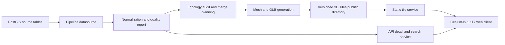

# Pipe Network Tiling Architecture

## Data Flow

## Why 3D Tiles

The line table is million-scale, so the browser must not create one Cesium Entity or one GeoJSON feature per pipe. The rendering path is GLB-backed 3D Tiles so Cesium can stream tiles on demand and keep the client memory profile bounded.

## Why Full GeoJSON And Entity Loading Are Rejected

Full GeoJSON and Entity loading would push source-scale feature management into the browser. That path does not fit dense pipe meshes, feature metadata, versioned publishes, or long-running map sessions.

## Fragmented Line Handling

The pipeline audits exact geometry duplicates, reverse duplicates, endpoint duplicates, short segments, and merge candidates. Same-attribute degree-2 chains are merged for display while every source identifier is preserved in `originalGuids`, so API lookup and quality reporting can still refer back to source `guid` values.

## API Lookup

Tiles carry stable feature metadata and a sidecar metadata path for API lookup. The API service provides search by `guid`, `qdbm`, `zdbm`, and `gdbm`, plus detail endpoints for lines and points.

## Versioned Publishing

Builds publish into a staging directory first. Validation requires `tileset.json`, `root.glb`, and `quality-report.json`; `latest.json` is updated only after validation succeeds, so a failed build does not replace the last stable version.
