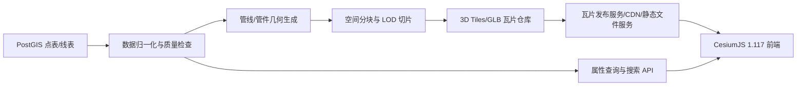

# Cesium 城市供排水管网三维可视化 PRD

文档日期：2026-06-21
适用阶段：一期产品定义与技术落地设计
目标版本：CesiumJS 1.117
读者：业务/甲方评审、产品、前后端开发、GIS 数据处理、三维资产制作

## 1. 背景

系统需要基于 PostgreSQL/PostGIS 中的点表和线表，构建城市供排水管网三维可视化能力，在 Cesium 中展示雨水、污水等管线以及雨水井、污水井、雨篦、污篦、进水口、排放口、闸门、泵站等管件设施。

当前数据库调研结果：

| 数据对象 | 表名 | 记录量 | 几何类型 | 实际 SRID | 关键字段 |
| --- | --- | ---: | --- | --- | --- |
| 点设施 | `public.sys_016_tancedbtjinfo_sde` | 19,842 | `ST_Point` | 3857 | `gdbm`, `lbmc`, `dmbg`, `kj`, `js`, `gg`, `jgcz`, `jgxz`, `jgcc`, `geom` |
| 管线 | `public.sys_016_tancexbtjinfo_sde` | 952,061 | `ST_LineString` | 3857 | `guid`, `qdbm`, `zdbm`, `cz`, `gg`, `qdms`, `zdms`, `qdndbg`, `zdndbg`, `gwlx`, `gs`, `gdcd`, `geom` |

当前点表类别分布以雨篦/污篦为主：雨篦 18,745 条、污篦 722 条、污水进水口 128 条、污水预留口 99 条、雨水进水口 88 条、雨水预留口 51 条、污水井 7 条、雨水井 2 条。

当前线表类别分布：污水管 488,921 条、雨水管 463,140 条；归属/范围字段 `gs` 中小区 724,303 条、市政 162,971 条、农村 64,741 条。

线表规格 `gg` 以数值管径为主，也存在 `200X200`、`300X300` 等矩形断面规格，以及 `0`、空值、非标准写法。线表中 `qdms`/`zdms` 有约 94.29 万条，`qdndbg`/`zdndbg` 有约 57.8 万条，说明三维埋深和高程可部分直接使用，剩余数据需要质量标记与默认策略。

## 2. 产品目标

一期目标是在不做在线编辑回写的前提下，提供可稳定承载百万级管线数据的三维浏览、筛选、定位和属性查询能力。

核心目标：

1. 在 CesiumJS 1.117 中加载全域供排水管网，支持按视域、层级、管网类型和设施类型渐进显示。
2. 管线以真实或近似真实的三维几何呈现，体现管径、断面、材质、类型、埋深或内底标高。
3. 点设施按类别使用参数化几何、图标化低模或 glTF 模型展示，兼顾识别性和性能。
4. 支持定期数据更新，通过后台预处理生成可发布的三维瓦片，不要求分钟级实时更新。
5. 支持基础交互：图层控制、雨污分类筛选、管径/材质筛选、点击拾取、属性面板、编码搜索、定位高亮。

非目标：

1. 一期不支持 Cesium 端新增、编辑、删除管线或管件。
2. 一期不做复杂水力模拟、流向推演、淹没分析。
3. 一期不要求所有管件都做高精模型；优先保证管网主体可视化完整、流畅、可查询。
4. 一期不让浏览器直连数据库，所有数据通过服务端 API 或静态瓦片发布。

## 3. 用户与场景

主要用户：

1. 管网运维人员：查看某片区雨污管线、井口/进水口位置、管径、材质、埋深等信息。
2. 项目管理/甲方评审人员：查看全域管网建设成果、不同类型管网覆盖范围、重点设施分布。
3. 数据管理人员：定期同步数据库后检查三维瓦片构建结果和异常数据清单。

典型场景：

1. 用户打开地图后，系统加载全域概览，远景以轻量线状或简化管线呈现，放大后显示真实管径管线和点设施。
2. 用户按雨水管/污水管筛选，系统切换对应图层颜色和可见性。
3. 用户点击一条管段，弹出属性面板，展示编码、起终点、规格、材质、管网类型、归属、长度、埋深/内底标高等字段。
4. 用户搜索 `gdbm`、`guid`、`qdbm` 或 `zdbm`，地图飞行定位并高亮目标。
5. 数据管理员完成新一批数据同步后，触发后台瓦片构建，生成质量报告并发布新版本。

## 4. 总体方案

采用“PostGIS 源数据 + 后台预处理 + 3D Tiles 三维瓦片 + Cesium 前端按需加载”的方案。

整体链路：



为什么不采用前端直接加载全量 GeoJSON/Entity：

1. 线表已达到 95.2 万条，未来还可能继续增长；Cesium Entity/DataSource 更适合中小规模动态对象，不适合作为百万级三维管线的主体承载方式。
2. 真实管径管线需要生成大量三角网格，必须提前分块、压缩、裁剪和分级加载。
3. 3D Tiles 原生面向大规模异构三维数据流式加载，Cesium 可根据视域和屏幕误差按需请求瓦片，适合本项目一期的“定期更新、只读展示”约束。

## 5. 数据处理设计

### 5.1 源数据使用原则

1. 空间定位以 `geom` 为主，当前实际 SRID 为 3857；切片时统一转换为 Cesium 使用的地理坐标/ECEF 坐标。
2. 点表 `gdbm` 作为点设施业务编码；线表 `guid` 作为管段主标识，`qdbm`/`zdbm` 用于关联起终点设施。
3. 线表 `gwlx` 用于雨水管/污水管分类，`gs` 用于市政/小区/农村等归属筛选。
4. 线表 `gg` 用于解析断面尺寸，优先识别纯数字圆管规格，其次识别 `宽X高` 矩形规格。
5. 线表 `cz` 用于材质配色、纹理或属性展示。
6. 高程优先级：
   - 优先使用 `qdndbg`/`zdndbg` 作为起终点内底标高，圆管中心高程为内底标高加半径，矩形管中心高程为内底标高加半高。
   - 若内底标高缺失但 `qdms`/`zdms` 存在，则结合地形/地面高程或配置的地面高程数据估算中心高程。
   - 若高程和埋深都缺失，则使用默认埋深策略生成可视化几何，并在属性中标记 `heightQuality=defaulted`。

### 5.2 规格解析规则

| 输入示例 | 解析结果 | 几何类型 |
| --- | --- | --- |
| `300` | 直径 300 mm | 圆管 |
| `600` | 直径 600 mm | 圆管 |
| `200X200` | 宽 200 mm，高 200 mm | 矩形箱涵/方沟 |
| `700X450` | 宽 700 mm，高 450 mm | 矩形箱涵/方沟 |
| `0`、空值、无法解析 | 默认显示尺寸，属性标记异常 | 简化管线或默认圆管 |

尺寸单位按毫米解析，生成三维几何时转换为米。异常规格不阻断瓦片构建，进入质量报告，并在前端可筛选。

### 5.3 网络拓扑

1. 以线表 `qdbm`/`zdbm` 关联点表 `gdbm`，生成管段与节点的拓扑关系。
2. 若起终点编码无法匹配点表，则使用线几何自身首末点作为虚拟节点。
3. 根据节点连接度识别双通、三通、四通、端点、疑似断点：
   - 连接度 1：端点、预留口、排放口或断点候选。
   - 连接度 2：普通连接或弯头候选。
   - 连接度 3：三通候选。
   - 连接度 4 及以上：四通或复杂节点候选。
4. 拓扑识别结果只作为可视化辅助和数据质量提示，不在一期回写源表。

### 5.4 数据质量报告

每次构建输出质量报告，至少包含：

1. 总记录数、成功生成数、跳过数。
2. 无几何、非法几何、空编码、重复编码统计。
3. 规格解析失败、规格为 0、管径异常过小/过大统计。
4. 高程缺失、埋深缺失、使用默认高程策略的记录数。
5. 起终点无法关联点表的管段数。
6. 按 `gwlx`、`gs`、`cz`、`gg` 的汇总统计。

## 6. 三维表达设计

### 6.1 管线

管线原则上不使用逐条外部模型，而是基于线表数据程序化生成三维几何。

可基于数据生成的管线：

1. 普通圆形雨水管、污水管：由 `LineString` + 管径 + 起终点高程生成圆管网格。
2. 直线或折线管段：按线几何逐段扫掠生成管体；当前数据均为 `ST_LineString`，适合该方式。
3. 矩形箱涵/方沟：由 `宽X高` 规格生成矩形断面管廊。
4. 缺少高程但有平面几何的管段：按默认埋深或半透明贴地下沉线生成近似可视化，并标识质量。
5. 远景管线：使用简化线、低边数圆管或按颜色区分的轻量几何，不展示完整断面细节。

需要特殊处理的管线：

1. 超大管径、异形断面、倒虹管、压力管、过河管、综合管廊等，如果源表只有简单规格，先用规则几何表达；若业务要求真实外观，再单独建模。
2. 规格异常或空值管段，不阻塞展示，使用默认尺寸和异常颜色/图例提示。
3. 与节点连接处出现明显断裂时，允许在切片阶段生成短接头或节点遮罩几何。

### 6.2 点设施和管件

点设施采用“参数化几何优先，模型资产补充”的策略。

适合用数据或参数化几何生成：

| 类别 | 一期表达方式 | 说明 |
| --- | --- | --- |
| 雨水井、污水井 | 圆柱井筒 + 井盖低模/圆盘 | 若缺少井深，使用默认深度并标记 |
| 雨篦、污篦 | 矩形篦子低模或贴地图标 + 简单边框 | 当前点表数量最多，必须轻量 |
| 雨水进水口、污水进水口 | 矩形口/侧入口低模 + 类型颜色 | 可根据类别和朝向扩展 |
| 雨水预留口、污水预留口 | 端点符号或小型封堵件 | 依赖拓扑端点识别增强 |
| 双通、三通、四通 | 根据拓扑连接度生成简化接头 | 若点表没有显式类别，可由线表拓扑推导 |
| 弯头 | 根据相邻管段夹角生成弯头符号或短弯管 | 一期可先低模表达 |
| 变径点、变材点 | 根据相邻管段规格/材质差异生成标记 | 一期作为节点标识，不强制真实建模 |

建议使用 glTF 模型或实例化模型：

| 类别 | 模型原因 |
| --- | --- |
| 消防栓 | 外观识别强，标准低模可复用 |
| 闸门/阀门 | 业务关注度高，结构形态比普通节点复杂 |
| 泵站 | 体量和外观差异大，应按站点模型或简化建筑模型表达 |
| 雨水排放口、污水排放口 | 常与河道/岸线/墙面关系有关，模型比参数几何更易表达 |
| 特殊井室、溢流井、截流井 | 结构非标准，按模型库扩展 |
| 业务指定重点设施 | 用高识别度模型支持汇报展示 |

模型资产要求：

1. 格式使用 glTF/GLB。
2. 同一类别复用同一模型，通过缩放、旋转、颜色和属性区分实例。
3. 模型面数和贴图大小按 LOD 管控；远景使用图标或极简模型，近景加载详细模型。
4. 模型库通过资产清单维护，不把模型路径硬编码在业务数据中。

## 7. Cesium 前端功能

### 7.1 地图与图层

1. 初始化 Cesium Viewer，加载底图、地形和管网 3D Tiles。
2. 图层树支持：
   - 雨水管、污水管。
   - 市政、小区、农村。
   - 管线、点设施、模型设施。
   - 异常数据图层。
3. 支持地下查看模式：
   - 管线半透明。
   - 地表透明度调节。
   - 垂直夸张系数。
   - 一键恢复默认视角。

### 7.2 样式与筛选

1. 管网类型默认配色：
   - 雨水管：蓝青色系。
   - 污水管：紫红或棕红色系。
   - 异常/未知：灰色或警示色。
2. 支持按管径范围、材质、归属、数据质量筛选。
3. 支持按管径映射粗细，按材质映射纹理或边线样式。
4. 高亮选中对象时，不修改源瓦片，只在前端维护临时高亮状态。

### 7.3 查询与定位

1. 点击拾取管线或点设施，展示属性面板。
2. 属性面板字段：
   - 管线：`guid`, `qdbm`, `zdbm`, `gwlx`, `gs`, `cz`, `gg`, `gdcd`, `qdms`, `zdms`, `qdndbg`, `zdndbg`, 数据质量。
   - 点设施：`gdbm`, `lbmc`, `dmbg`, `kj`, `js`, `gg`, `jgcz`, `jgxz`, `jgcc`, 数据质量。
3. 支持按编码搜索定位：
   - 管段：`guid`。
   - 点设施：`gdbm`。
   - 起终点：`qdbm`/`zdbm`。
4. 搜索结果定位后自动飞行到目标，打开属性面板并高亮。

### 7.4 性能体验

1. 首屏先加载区域概览和低 LOD，随后按视角加载细节瓦片。
2. 前端避免创建百万级 Entity；主体数据通过 `Cesium3DTileset.fromUrl` 加载。
3. 图层切换优先通过 tileset 显隐、样式过滤或服务端图层拆分实现，避免频繁销毁重建大量对象。
4. 长时间浏览后释放不可见瓦片缓存，防止显存和内存持续上涨。

## 8. 后端与切片服务

### 8.1 组件

1. 数据读取模块：从 PostGIS 读取点表、线表，支持按更新时间或版本号构建。
2. 归一化模块：解析规格、材质、类别、高程和拓扑。
3. 几何生成模块：生成圆管、矩形箱涵、节点低模、模型实例变换矩阵。
4. 切片模块：按空间范围、层级和几何复杂度生成 3D Tiles。
5. 发布模块：将瓦片和 `tileset.json` 发布到静态文件服务、对象存储或 CDN。
6. 查询 API：提供编码搜索、属性详情、构建版本、质量报告查询。
7. 管理 API：触发构建、查看构建状态、切换发布版本。

### 8.2 切片策略

1. 按空间四叉树或 Web Mercator 瓦片网格分块。
2. 雨水管、污水管可以拆成独立 tileset，便于独立显隐和按需加载。
3. 点设施和模型设施可以拆成独立 tileset，降低管线瓦片复杂度。
4. 每个瓦片控制最大要素数和最大三角面数，避免单瓦片过大。
5. 建议远景瓦片使用简化几何，近景瓦片使用完整断面。
6. 每个 feature 保留稳定 ID 和必要批量属性，点击后可直接显示基础信息；完整详情由 API 回源查询。
7. 避免使用 Cesium 1.117 中标记实验性的 3D Tiles vector 特性作为一期核心依赖。

### 8.3 构建与发布

1. 每次构建生成版本号，例如 `network-YYYYMMDD-HHmm`。
2. 构建完成后先进入预发布目录，自动校验 `tileset.json`、瓦片数量、文件大小和质量报告。
3. 校验通过后切换发布指针，前端通过版本清单加载最新稳定版本。
4. 若构建失败，线上继续使用上一稳定版本。
5. 构建日志、质量报告和发布版本需要可追溯。

### 8.4 数据安全

1. 数据库连接信息只放在服务端环境变量或密钥配置中，不写入前端和静态文件。
2. 前端只访问瓦片服务和 API。
3. 属性 API 根据系统权限控制可见字段，避免敏感字段直接进入瓦片批量属性。

## 9. 性能指标

参考验收环境：主流 Chrome/Edge 浏览器，16 GB 内存，普通独显或较新的集显，网络带宽不低于 50 Mbps。最终指标以项目实际硬件环境复测为准。

一期建议指标：

| 指标 | 目标 |
| --- | --- |
| 数据规模 | 支持至少 100 万条管段、5 万个点设施 |
| 首屏可交互 | 常规网络下 5 秒内进入可浏览状态 |
| 平移/缩放流畅度 | 常规视角 30 FPS 左右，极密集区域不低于 20 FPS |
| 单瓦片大小 | 常规瓦片压缩后控制在 1-5 MB，超密集区域允许分裂 |
| 内存控制 | 长时间浏览后浏览器内存不持续无界增长 |
| 点击响应 | 已加载对象拾取与基础属性展示 300 ms 内响应 |
| 搜索定位 | 编码搜索 1 秒内返回结果，飞行定位按 Cesium 动画执行 |
| 构建可用性 | 新版本构建失败不影响上一稳定版本访问 |

## 10. 验收标准

业务验收：

1. 能在 Cesium 中看到完整雨水/污水管网，支持全域概览和局部细节浏览。
2. 雨水管、污水管颜色区分清晰，图例和图层控制一致。
3. 管径、材质、归属、异常数据可筛选。
4. 点击管线和点设施可查看关键属性。
5. 编码搜索可定位到指定管段或点设施。
6. 主要点设施类型有可识别表达；当前数据中雨篦、污篦、进水口、预留口优先完成。
7. 数据更新后可发布新瓦片版本，并能查看构建质量报告。

技术验收：

1. 前端不以百万级 Entity/GeoJSON 全量加载作为主体方案。
2. 管线主体以 3D Tiles 按需加载。
3. 瓦片构建支持异常数据容错，不因少量异常记录中断全量发布。
4. 每个可拾取对象具备稳定业务 ID。
5. 高程和规格解析规则有自动化测试覆盖。
6. 性能测试覆盖全域、密集区、频繁缩放、图层切换和长时间浏览。

## 11. 测试计划

数据测试：

1. 规格解析测试：覆盖纯数字、`宽X高`、空值、`0`、中文或非标准写法。
2. 高程计算测试：覆盖内底标高、埋深估算、默认高程三种路径。
3. 拓扑测试：覆盖匹配节点、虚拟节点、断点、三通、四通。
4. 坐标转换测试：验证 SRID 3857 到 Cesium 坐标的转换位置正确。

切片测试：

1. 验证每个 tileset 可被 CesiumJS 1.117 正常加载。
2. 验证瓦片 bounding volume 覆盖正确，不出现大面积消失或错误加载。
3. 验证批量属性或 feature ID 与 API 详情一致。
4. 验证异常记录进入质量报告。

前端测试：

1. 图层显隐、筛选、搜索、拾取、属性面板。
2. 全域浏览、密集区域浏览、地下查看模式。
3. 低端浏览器环境下的降级策略，例如关闭模型细节、降低垂直夸张、只显示简化管线。

性能测试：

1. 首屏时间、FPS、内存、显存、瓦片请求数。
2. 连续 30 分钟浏览后内存稳定性。
3. 不同网络带宽下的加载体验。

## 12. 里程碑

| 阶段 | 交付物 | 重点 |
| --- | --- | --- |
| M1 数据字典与样式规范 | 字段映射、类别字典、材质/管径/颜色规范、质量规则 | 锁定数据解释 |
| M2 管线瓦片 MVP | 雨污管线 3D Tiles、基础 LOD、点击拾取 | 验证百万级主体性能 |
| M3 点设施与模型库 | 雨篦/污篦/进水口低模，消防栓/闸门/泵站模型规范 | 建立资产体系 |
| M4 查询与筛选 | 图层树、筛选、搜索定位、属性面板 | 完整业务闭环 |
| M5 构建发布流程 | 定期同步、质量报告、版本切换、失败回滚 | 生产可运维 |
| M6 性能与验收 | 性能报告、缺陷修复、验收材料 | 上线准备 |

## 13. 风险与约束

1. 源表 `geometry_columns` 中目标表曾显示 SRID 为 0，但实际记录 SRID 为 3857；构建前必须以 `ST_SRID(geom)` 实测为准，并对异常 SRID 做报告。
2. 点表当前类别覆盖不完整，用户提到的消防栓、闸门、泵站、排放口等可能来自未来数据或其他表；一期资产体系要支持扩展，不要求当前表内全部出现。
3. 高程字段语义需要在 M1 与数据字典确认；PRD 中采用字段名推断的优先级策略，实施时以数据字典为最终依据。
4. 管径和断面字段存在异常值，必须允许默认显示和质量标记，不能因为异常导致整批失败。
5. 如果业务要求非常真实的地下管件连接细节，模型制作量会显著增加；一期先以可识别、可查询、性能稳定为主。
6. Cesium 1.117 作为固定版本，切片格式、glTF 扩展和压缩方式必须用该版本实测，不以最新版 Cesium 能力作为验收依据。

## 14. 推荐文件组织

当前仓库尚无既有文档结构，建议从以下结构开始：

```text
docs/
  prd/
    2026-06-21-cesium-pipe-network-3d-prd.md
  architecture/
    pipe-network-tiling-architecture.md
  data/
    pipe-network-field-dictionary.md
    pipe-network-quality-rules.md
  assets/
    pipe-network-model-asset-list.md
```

本文件作为一期 PRD 放在 `docs/prd/` 下。后续实施计划、接口设计、字段字典和模型资产清单分别进入对应目录，避免一个 PRD 无限膨胀。

## 15. 参考资料

1. CesiumJS `Cesium3DTileset` 文档：<https://cesium.com/learn/cesiumjs/ref-doc/Cesium3DTileset.html>
2. CesiumJS `Cesium3DTileFeature` 文档：<https://cesium.com/learn/cesiumjs/ref-doc/Cesium3DTileFeature.html>
3. CesiumJS `PolylineVolumeGraphics` 文档：<https://cesium.com/learn/ion-sdk/ref-doc/PolylineVolumeGraphics.html>
4. CesiumJS `ModelGraphics` 文档：<https://cesium.com/learn/cesiumjs/ref-doc/ModelGraphics.html>
5. OGC 3D Tiles 标准：<https://docs.ogc.org/cs/22-025r4/22-025r4.html>
