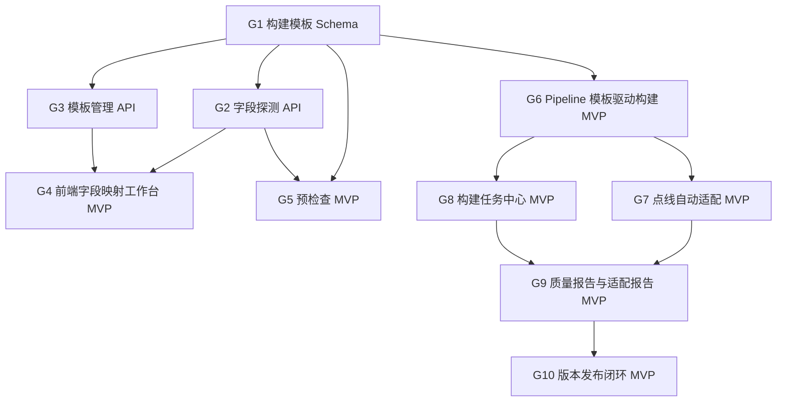

# 参数化管网构建平台二期可执行目标

来源 PRD：`docs/prd/2026-06-23-parametric-pipe-network-build-prd.md`
目标用途：把二期 PRD 拆成可排期、可开发、可验收的执行目标。
执行原则：先完成一条从“模板配置”到“生成并发布可加载 3D Tiles”的最小闭环，再逐步增强自动适配、任务中心和版本治理能力。

## 1. 总目标

二期完成后，系统应支持数据管理员在前端完成以下闭环：

1. 选择 PostGIS 数据源、线表和点表。
2. 配置字段映射、单位、默认值和自动适配规则。
3. 保存为构建模板。
4. 执行预检查并确认风险。
5. 启动后台构建任务。
6. pipeline 按模板参数化读取数据并生成 3D Tiles。
7. 查看质量报告和适配报告。
8. 发布新版本。
9. Cesium 前端加载新发布版本。

验收口径：用户不修改代码、不改命令行参数，仅通过前端配置和后端任务，即可基于当前参考点表/线表生成一版可加载、可查询、可回滚的管网三维瓦片。

## 2. MVP 目标

MVP 只做一条完整可用链路，先保证“能配置、能构建、能发布、能看结果”。

### G1 构建模板 Schema

目标：定义稳定的构建模板数据结构，承载字段映射、单位规则、默认值、LOD 参数和输出配置。

范围：

1. 模板基本信息：`id`、`name`、`description`、`version`、`status`。
2. 数据源引用：`dataSourceId`。
3. 线表配置：schema、table、geometryField、fieldMapping。
4. 点表配置：schema、table、geometryField、fieldMapping。
5. 单位配置：管径、点尺寸、标高、埋深、长度。
6. 默认规则：默认管径、默认埋深、默认点尺寸、默认地面标高。
7. 流向规则：字段、正向值、反向值、未知值策略。
8. LOD 参数：maxFeaturesPerTile、maxTileBytes、maxDepth、radialSegments。
9. 输出配置：versionNameStrategy、includeAggregateMetadata。

完成定义：

1. 模板可以被序列化为 JSON。
2. 模板有运行时校验。
3. 模板校验错误能返回具体字段路径和错误原因。
4. 默认模板能覆盖当前参考线表和点表。

验收证据：

1. 单元测试覆盖合法模板、缺必填字段、非法单位、非法 LOD 参数。
2. 示例模板文件可以通过校验。

### G2 字段探测 API

目标：后端能读取 PostGIS 表结构和基础统计，为前端字段映射提供候选信息。

范围：

1. 获取 schema 列表。
2. 获取表列表。
3. 获取字段名、数据类型、是否可空。
4. 获取几何字段、SRID、几何类型。
5. 获取字段样例值。
6. 获取基础统计：记录数、空值率、唯一值数量或唯一率。
7. 给出字段语义推荐，例如 `guid` 推荐为管段编码，`gdbm` 推荐为点编码。

完成定义：

1. API 能返回当前参考点表和线表字段。
2. API 不暴露数据库密码。
3. 字段推荐允许前端覆盖。
4. 大表统计采用抽样或安全 SQL，不阻塞服务。

验收证据：

1. API 测试覆盖字段列表、几何信息、样例值和推荐映射。
2. 使用当前数据源可返回点表和线表候选字段。

### G3 模板管理 API

目标：后端支持构建模板的保存、读取、复制、更新和导出。

范围：

1. 模板列表。
2. 模板详情。
3. 创建模板。
4. 更新模板。
5. 复制模板。
6. 导出模板 JSON。
7. 导入模板 JSON。
8. 模板状态：draft、validated、published、archived。

完成定义：

1. 模板保存后可再次读取。
2. 每次修改生成模板版本号或更新时间。
3. 导出的模板不包含密钥。
4. 非法模板不能保存为 validated。

验收证据：

1. API 测试覆盖 CRUD、复制、导入导出、非法模板。
2. 模板数据落盘或入库后重启服务仍可读取。

### G4 前端字段映射工作台 MVP

目标：前端提供一个可操作的构建配置页面，用户能基于字段探测结果生成模板。

范围：

1. 数据源选择。
2. 点表、线表选择。
3. 字段映射表单。
4. 单位选择。
5. 默认值配置。
6. LOD 参数配置。
7. 保存模板。
8. 加载已有模板继续编辑。

完成定义：

1. 用户可以从空白状态创建模板。
2. 系统能根据字段名自动推荐映射。
3. 用户可以覆盖推荐映射。
4. 保存后模板出现在模板列表。
5. 表单不要求一次覆盖 PRD 中所有高级规则，但必须覆盖当前参考表构建所需字段。

验收证据：

1. 前端测试覆盖模板表单初始值、字段推荐、用户覆盖、保存调用。
2. 手动验收能保存一份当前参考表模板。

### G5 预检查 MVP

目标：在正式构建前验证模板和源数据是否可构建。

范围：

1. 表是否存在。
2. 几何字段是否存在。
3. 几何类型是否符合点表、线表。
4. SRID 是否符合预期。
5. 必需字段是否缺失。
6. 编码字段空值率。
7. 起终点编码与点编码匹配率。
8. 规格字段可解析率。
9. 高程字段覆盖率。
10. 输出 error、warning、info。

完成定义：

1. error 阻止构建。
2. warning 允许构建但需要用户确认。
3. 预检查结果能在前端展示。
4. 预检查结果被记录到构建任务或模板验证记录中。

验收证据：

1. 测试覆盖无表、无几何字段、SRID 不一致、字段缺失、warning 确认。
2. 当前参考表模板预检查可以通过，且能显示点参数缺失 warning。

### G6 Pipeline 模板驱动构建 MVP

目标：pipeline 不再写死当前字段名，而是按构建模板读取字段、解析单位和生成瓦片。

范围：

1. pipeline 接收模板 ID 或模板 JSON。
2. 按模板读取线表字段。
3. 按模板读取点表字段。
4. 按模板单位解析管径、标高、埋深。
5. 按模板流向规则生成流向属性。
6. 按模板 LOD 参数输出 3D Tiles。
7. 保留现有发布结构：tileset.json、root.glb、metadata.json、quality-report.json、tiles/*.glb。

完成定义：

1. 当前参考模板能构建出与现有版本等价或更好的 3D Tiles。
2. 修改模板字段映射后，pipeline 使用新字段而不是固定字段名。
3. 构建失败时输出明确错误，不发布坏版本。

验收证据：

1. 单元测试覆盖 fieldMapping 到标准中间结构。
2. 集成测试使用 fake datasource 和模板构建 tiles。
3. 真实 PostGIS 构建能通过 validate。

### G7 点线自动适配 MVP

目标：点数据缺少尺寸、高程、类型时，使用线表拓扑和默认规则生成可解释的点设施参数。

范围：

1. 编码关联：线表起终点编码匹配点表点编码。
2. 连接度统计。
3. 节点类型推断：端点、双通、三通、四通、弯头候选。
4. 点尺寸推断：点字段优先，相邻管线最大管径次之，类型默认再次之。
5. 点高程推断：点字段优先，相邻管线端点高程次之，默认值再次之。
6. 推断来源写入 metadata 和适配报告。

完成定义：

1. 缺少 `jgcc` 的井/篦不再使用固定 3m 或 4m 粗暴尺寸。
2. 缺少 `dmbg` 的点能从相邻线或默认规则获得可解释高程。
3. 弯头、双通、三通、四通至少能按连接度和方向生成候选类型。
4. 每条推断都有来源标记。

验收证据：

1. 测试覆盖点尺寸字段解析、相邻线推断、默认尺寸。
2. 测试覆盖点高程字段解析、相邻线推断、默认高程。
3. 测试覆盖连接度类型推断。
4. 适配报告中能看到各来源数量。

### G8 构建任务中心 MVP

目标：后端提供后台构建任务，前端能查看状态和日志。

范围：

1. 创建构建任务。
2. 任务状态：queued、preprocessing、tiling、validating、completed、failed、canceled。
3. 任务日志。
4. 任务进度。
5. 任务输出版本。
6. 任务失败原因。
7. 取消任务。

完成定义：

1. API 请求不会因为构建长任务阻塞。
2. 任务状态可轮询。
3. 构建失败保留日志。
4. 取消任务会清理 staging 目录。

验收证据：

1. API 测试覆盖任务创建、状态变化、失败、取消。
2. 前端任务列表可看到实时状态。

### G9 质量报告与适配报告 MVP

目标：构建完成后，用户能看到数据质量和自动适配结果。

范围：

1. 质量报告包含模板 ID、模板版本、记录数、成功数、失败数。
2. 规格解析统计。
3. 高程来源统计。
4. 点尺寸来源统计。
5. 点线匹配统计。
6. tile 数量、最大 tile 大小、平均 tile 大小。
7. 适配报告包含推断来源和异常样例。
8. 前端可查看报告。

完成定义：

1. 报告和构建版本绑定。
2. 报告可通过 API 读取。
3. 前端能展示核心统计和异常样例。

验收证据：

1. 测试覆盖报告生成。
2. 真实构建版本能打开质量报告和适配报告。

### G10 版本发布闭环 MVP

目标：构建完成后可以发布新版本，也可以回滚到旧版本。

范围：

1. 构建输出先进入 staging。
2. validate 通过后进入可发布状态。
3. 用户手动发布版本。
4. latest 指针切换。
5. 回滚到历史版本。
6. 前端加载 latest。

完成定义：

1. 构建完成不自动覆盖线上版本。
2. 发布失败不影响当前 latest。
3. 回滚后前端加载旧版本。
4. 版本记录包含模板版本、构建任务 ID 和质量报告地址。

验收证据：

1. 测试覆盖发布、失败保留旧 latest、回滚。
2. 手动验收能在 Cesium 中加载新发布版本。

## 3. 增强目标

增强目标在 MVP 闭环稳定后实施。

### E1 几何邻近匹配

目标：起终点编码无法匹配时，按线端点和点几何距离寻找候选点。

完成定义：

1. 距离阈值可配置。
2. 多候选冲突进入报告。
3. 匹配来源标记为 `node-match-nearest`。

### E2 模板导入导出与项目迁移

目标：模板可以在不同环境迁移。

完成定义：

1. 导出 JSON 不包含密钥。
2. 导入时校验 schema 版本。
3. 导入后可重新绑定数据源。

### E3 构建结果三维预览

目标：构建完成但未发布时，也能在前端预览该版本。

完成定义：

1. 任务详情页可打开预览。
2. 预览不改变 latest。
3. 预览失败不影响发布状态。

### E4 版本差异

目标：对比两个构建版本的数据规模和质量指标。

完成定义：

1. 对比记录数、异常数、tile 数、最大 tile、质量指标。
2. 前端展示差异摘要。

### E5 权限分级

目标：区分查看、构建、发布、管理员权限。

完成定义：

1. viewer 只能查看版本和报告。
2. builder 可创建模板和构建任务。
3. publisher 可发布和回滚。
4. admin 可管理数据源。

## 4. 暂不纳入二期 MVP 的目标

以下内容不进入 MVP，避免二期第一阶段过大：

1. 在线编辑点线数据。
2. 回写源数据库。
3. 水力模拟。
4. 任意数据库类型接入。
5. 高精模型资产管理后台。
6. 道路数据参与雨篦朝向推断。
7. 多用户协同编辑模板。
8. 构建任务分布式调度。

## 5. 推荐实施顺序



建议排期：

1. 第一阶段：G1、G2、G3。
2. 第二阶段：G4、G5。
3. 第三阶段：G6、G7。
4. 第四阶段：G8、G9、G10。
5. 第五阶段：E1、E2、E3、E4、E5 按项目优先级选择。

## 6. 第一阶段最小交付

如果需要马上启动开发，第一阶段只做三件事：

1. 构建模板 Schema。
2. 字段探测 API。
3. 模板管理 API。

第一阶段完成后应能回答：

1. 当前数据库有哪些可选点表和线表。
2. 每张表有哪些字段、类型、样例、SRID 和几何类型。
3. 用户选择字段后能保存成一份合法模板。
4. 模板能被后续预检查和 pipeline 使用。

第一阶段验收命令建议：

```powershell
pnpm test:api
pnpm test:pipeline
pnpm typecheck
```

第一阶段人工验收：

1. 打开 API，获取当前参考点表和线表字段。
2. 创建一份参考模板。
3. 重新读取模板，确认字段映射、单位、LOD 参数完整。
4. 导出模板 JSON，确认不包含数据库密码。

## 7. 全量 MVP 验收清单

MVP 完成时，必须同时满足：

1. 前端能创建构建模板。
2. 前端能执行预检查。
3. 预检查 warning 需要用户确认。
4. 前端能启动构建任务。
5. 后端任务状态可查询。
6. pipeline 使用模板字段而不是固定字段。
7. 点设施尺寸和高程能按点线规则自动适配。
8. 质量报告包含模板和自动适配统计。
9. 构建版本不会自动覆盖 latest。
10. 用户可以手动发布版本。
11. 用户可以回滚版本。
12. Cesium 前端能加载新发布版本。
13. 真实参考数据构建通过 validate。
14. 自动化测试覆盖模板、字段映射、预检查、pipeline 构建、自动适配、任务、发布。

## 8. 成功标准

二期成功不是“页面做出来”，而是形成可复用构建能力。

成功标准：

1. 接入当前参考点线表不需要修改代码。
2. 改一套字段名相似但不相同的数据，只需要调整模板。
3. 点表缺少尺寸和高程时，系统能生成可解释的默认或推断模型。
4. 构建结果的每个关键推断都有来源标记。
5. 数据管理员能通过质量报告判断是否可以发布。
6. 发布新版本失败不会影响旧版本。
7. 前端可视化性能不低于一期 LOD 版本。
